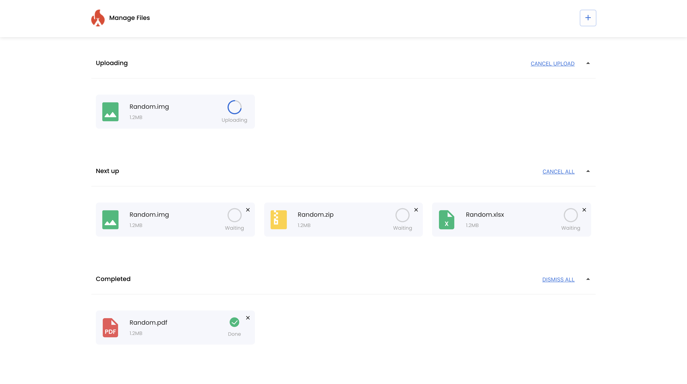

# fk-project

File upload simulator



<br>

## Features

-    A user is able to 'add' files to the upload queue
-    A user is clearly able to see the progress and state of each file being uploaded
-    A user is able to cancel an upload in progress
-    A user is able to retry canceled or failed uploads

<br>
## Build Setup

```bash
# install dependencies
$ npm install

# serve with hot reload at localhost:3000
$ npm run serve

# build for production and launch server
$ npm run build
```
